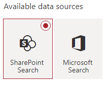

## Introduction

## Getting the Web Parts
The latest version of the PnP Modern Search web parts can be found using [this link](https://github.com/microsoft-search/pnp-modern-search/releases/latest).

For the purposes of this blog, we're looking at v4.1.0, which can be found using [this link](https://github.com/microsoft-search/pnp-modern-search/releases/tag/4.1.0) (in case it's no longer the latest).

Just scroll down to the bottom of the page and download the `.SPPKG` file.

## Installing the Web Parts
Installing the web parts is simple, so long as you have the correct level of permissions. The Modern Search web parts must be installed to an *App Catalog*, either at the **Tenant** or **Site** level. For the purposes of this blog, we'll assume that you already have an app catalog created at the level you need. If that's not the case, please refer to this documentation for instructions on how to [Use the App Catalog to make custom business apps available for your SharePoint environment](https://docs.microsoft.com/en-us/sharepoint/use-app-catalog).

The differences in the process for deploying apps to a tenant app catalog vs. a site app catalog aren't drastically different and basically boils down to where you actually find the app catalog. For the purposes of this blog, we'll focus on deploying to the Tenant app catalog.

### Finding the Tenant App Catalog
If you want these web parts available on all sites in your tenant (and why wouldn't you?), you'll want to deploy them to the tenant app catalog. Doing this will, of course, require you to have an account with the *SharePoint Admin* role. Access your SharePoint Admin Center - `https://<YourTenantName>-admin.SharePoint.com` - click the  item on the navigation panel. 

Once you're on the **More features** page, find the *Apps* card and click the 'Open' button.


Clicking this will open your Tenant's app catalog site, which should include an **Apps for SharePoint** menu item on the quick launch. Doing so will open up a list which will show all of the custom apps deployed to your tenant. 

### Deploying the SPPKG
Locate the SPPKG file you downloaded earlier and simply drag and drop it into your list. Once the file gets uploaded, you'll be prompted with a pop-up that looks like the below.


> **IMPORTANT** - If you want the web part to be immediately available on all sites, be sure to check the box. Otherwise, it has to be added on each site you intend to use it on.  

> **NOTE** - The *Make this solution available...* option only appears when deploying to the Tenant app catalog  

Once you click Deploy and a few moments have passed, the app should install without any issue. You can confirm by checking the *App Package Error Message* column in your app catalog, which should say "No errors". 

### Granting API Permissions
One of the newer features available in V4 of the Modern Search web parts is the ability to leverage the Graph to surface search results. Although this blog is focused on using the standard SharePoint search results approach, this is an incredibly awesome feature that can allow you pull together content from any number of locations in the M365 cloud; or outside of it, if you're using custom search connectors!

If you intend to leverage the Graph, you will need to grant the API permissions the web parts need in order for it to function; and to do that you'll need to be a SharePoint Admin.

Just head on over to the the SharePoint Admin Portal (`https://<YourTenantName>-admin.SharePoint.com`), expand the *Advanced* menu item and click the **API Access** option. Once there, you may see a set of "Pending Requests" being requested by the PnP Modern Search web parts. If not, they'll start showing up once you begin using the web parts. 

Once the permissions have been requested, you'll need approve each one individually which is as easy as selecting the requested permission, clicking the **Approve** button at the top of the list, and then clicking the second **Approve** button on the *Approve access* panel that opens.

## Setting up for the demo

## Configuring the Search Box web part
In keeping with the spirit of our "Minimal Path to Awesome" approach, the Search Box web part will be the easiest to configure of the lot. We can just drop it on the page somewhere and be done.


That doesn't mean, however, that it has to be that simple. Version 4 has introduces more advanced features than we'll be making use of, but that doesn't mean we can't take a peak.

### Panel 1 - Search box settings
The first configuration panel intially offers two settings.


The first setting will replace the default "*Enter your search terms...*" placeholder text with whatever you type here. 

The second setting - **Send the query to a new page** - will be off by default (and will stay that way for this example). If you enable it, you'll see some new options appear that allow you send the user's query to a new page/tab. 

This can be incredibly useful if you want to create "Search Results" page like what we're currently doing, but also want to provide a search box on other pages. Using this we could, for example, include a Search box web part on the home page of our site and, when a user submits a query, the query is passed to the page we're building and search results are shown.

### Panel 2 - Query Suggestions
It's possible to provide users with some search suggestions (you know, the things that appear beneath what you're typing in search engines like Bing or Google) to help speed them along their search journey. 

As users search for a particular term or phrase and click on search results, SharePoint will (supposedly) make a correlation between the two. In our example, if a user searched for ***World of Warcraft*** and clicked on the result ***World of Warcraft: Legion*** six times, SharePoint would begin suggesting ***World of Warcraft: Legion*** as a potential query.

> **NOTE**: I used the word *supposedly* earlier because I never saw this feature working in my example. I assume this is either because the search results we're creating aren't clickable, or that the Search suggestions are only curated when you're using the built-in search boxes, such as the Microsoft Search bar.

### Panel 3 - Available Connections
The last panel of options includes configurations that allow us to pull queries from other sources.


Again, we're not going to be dealing with these on our MPA. However, referring back to the example of having a search box on a home page sending queries to the page we're currently building, we would want to select the "Query string" option here and specify our parameter name. Once configured, we could pass query information from one page and pull it in here.

## Configuring the Search Verticals web part
Verticals allow users to limit their search results to a specific *kind* of result. If you've been around SharePoint long enough, you've no doubt seen the standard *All*, *Files*, *People*, *Sites*, etc... verticals that SharePoint shows when you search for stuff. 

Well, the *Search Verticals* web part allows us to create our own verticals that enable our users to see results for specific platforms.

In terms of difficulty, the *Search  Verticals* web part comes in second place in our example, although it's probably the easiest to configure overall if you count the Search Box features we're not making use of.


While the other three web parts in this package saw new features (and added complexity), this web part is actually much easier to use now. There's only one configuration panel to deal with, so let's take a look.

### Panel 1 - Search verticals configuration
When you open up the Search Verticals web part, you'll be greated with a singular button that says **Configure Verticals**. 


When clicked, you get the real deal...


We can add any number of verticals simply by giving them a name and setting an order. We can also make use of the standard Fabric icons if we wish (and we do!) and, if we choose, we can make verticals a link that opens a new page when clicked. 

Since we want our users to stay on the same page, we're not going to bother with hyperlinks, but we will go ahead and create verticals for the latest generation of platforms available in our dataset, as well as an "All" vertical.

### Search Verticals Summary
That's all there is to it, really. However, one important thing to keep in mind is that each vertical you choose add will require a separate instance of the Search Results web part. For those that are familiar with previous versions of these web parts, this is definitely a deparature from what we're used to.

## Configuring the Search Refiners web part
Once a user gets to searching, they may want to be able to filter the results by certain criteria. We can use the *Search Filters* web part to fulfil that demand.

### Panel 1 - Available Connections
For refiners to show, the need search results to refine. The Available connections web part will allow you select one or more *Search Results* web parts. If you haven't already added one, there won't be any options, so make sure you've added one first. Once you've got one, select it here. 

Later, you'll see that we end up with multiple *Search Results* web parts, so we'll revist this after that point to update it so our refiners respect that.

### Panel 1 - Filter Settings
The other section has two different settings we can configure.


Clicking the edit button will, again, open up a meme-worth panel. Unlike the last panel, though, this new panel is far more involved.


Most of the settings are, I think, pretty self explanatory and you can see the settings used for the demo in the above screenshot.

However, it's important to note that the values you use in the "Filter field" column **MUST** map to a managed property that has been marked as Refinable. In our case, we've already gone into our search schema and mapped the columns we wanted to filter by to the provided Refinable managed properties (again, refer to the setup section for details).

### Panel 2 -  Available Layouts
We have three pre-canned layouts available to us, as well as a Custom option which you can use to present your filters in any way you can imagine. 


The *Vertical* and *Horizontal* options are self-descriptive, while the *Panel* option will cause a panel to flyout from the right (like how the web part properties do). 

Since our Filter web part is in a vertical column, we'll just stick with that option.

## Configuring the Search Results web part.
The *Search Results* web part is, as the name implies, the component we use to actually show search results for the things users are searching for. It's also where things start getting little more involved.


Unlike the previous two web parts, there's a lot of different settings, combinations, and customization potential in this web part. Since we're focused on just getting a quick win, we're going to mostly focus on the basics.

### Panel 1 - Available data sources
The first section we have to deal with is choosing where we will pull search results from: SharePoint or Microsoft Search?



As was mentioned in the at the beginning of this blog, all of our data is in SharePoint, so we're just going to go with that. We could, of course, use Microsoft Search to get the data as well...but we'll leave that for another time. Just note that if you decide to go forward with Microsoft Search, some of the configuration options will change based on that context.

### Panel 1 - Layout slots
If you click the Customize button, you'll be presented with another flyout panel with a bunch of default entries. There's a brief description at the top that tries to explain what these are, but honestly didn't make much sense to me in the beginning.

Search results are, behind the scenes, being rendered using [Handlebars](https://handlebarsjs.com/) templates. Each one of these *Slots* will create a variable that can be referenced in a template and is tied back to a property returned in the search results. 


Considering the above, there will be a property exposed in the Handlebars template called "Author" that is mapped to the "AuthorOWSUSER" managed property. 

For those of us walking the *minimalist* path, this isn't necessary. However, the search results shown in screenshots does make use of custom templates and does rely on some custom layout slots to tie into the managed properties associated with our list of video games. Below is a table of the mappings for those following along.

|Slot name|Slot field|
|-|-|
|Developer|DeveloperOWSCHCS|
|Rating|ESRBRatingOWSCHCS|
|Genre|GenreOWSCHCS|
|IMGURL|imgurlOWSURLH|
|Platform|PlatformOWSCHCS|
|Publisher|PublisherNameOWSCHCS|
|Rank|RankOWSN|
|Year|YearOWSNMBR|

### Panel 1 - SharePoint Search
This section has a lot going on and is our first real chance to influence what search results are surfaced for the  user.

#### Query Template
The first option is the *Query template* text box. By default, it will simply have `{searchTerms}` loaded into it, which acts as a token to represent whatever search query is being fed to the web part. In our case, that will be whatever the user has typed into the *Search Box* web part. You can enter your KQL query here, which can enable you to restrict search results to, say, a particular content type ID like so...

```
{searchTerms} ContentTypeId:0x01004527A5975C6A534DAE7EBFD57E41A633*
```

In this case, the content type ID being used is for a "Video Game Data" content type that is used for items in our list. So, by doing this, we're limiting our search results to only those that match our content type.

This also gives the benefit of displaying default search results when the user enters the page, which is pretty useful in our example.

#### Result source ID
Immediately below that is the *Result source ID* field, which allows you select a SharePoint Search Result Source. By default, it will be set to **LocalSharePointResults**. If you're using the method above, you can leave it there. The other option is to create your own custom Search Results type to limit results to our content type and supply the GUID for that here. The end result is the same, ultimately.

#### Selected Properties
Next up is the *Selected Properties* dropdown. The web part will have a number of properties selected by default, and if you're just wanting to leverage the default layout options, you can leave this alone as well. If, however, you want to display different properties on your search results you can (de)select as many options as you need. You won't be able to make use of any property you haven't included here though, so bear that in mind.

Our search results don't need any of the default options. Instead, you can just copy & paste the below string into the text box to get going.

```
DeveloperOWSCHCS,ESRBRatingOWSCHCS,GenreOWSCHCS,imgurlOWSURLH,PlatformOWSCHCS,PublisherNameOWSCHCS,RankOWSNMBR,Title,YearOWSNMBR
```

Each one of those values points to a managed property that was created when our site columns were provisioned and allows us to show that data on our result cards.

#### Sort order
I think this one is fairly self explanatory. You select a managed property (or properties), things get sorted as you specify. 


The only thing to keep in mind here is that the property you select must be marked as being sortable in the Search schema, which they won't be by default and is why we're referencing *RefinableInt00* in the screenshot above. If you skimmed the setup readme linked in the introduction, you'd know that this is mapped to our *Rank* column.

#### Refinement filters
You can add additional filters to search results here. This is another way, similar to the *Query text* example above, to limit what results are returned. 

We could totally add our `ContentTypeId:0x01004527A5975C6A534DAE7EBFD57E41A633*` filter here, if we chose, instead of the *Query text* box above. 

The biggest difference would be that we wouldn't see any search results until the user actually searched for something.

#### The other options...
There are five other options available in this section which are somewhat self explantory. The only exception to the rule might be the *Enable query rules* options, which is more than we're going to get into here (and honestly not something I'm familiar with).

### Panel 1 - Paging options
This section, as the name implies, allows you to configure paging options. They're all straight forward and the only one we changed for the demo was the *Number of items per page*, which we set to 9 - the idea being that we wanted to show three cards per row (which left a straggler).

### Panel 2 - Available layouts
This panel is more straight forward that the last. Select a layout, and configure any common or layout specific options you want.


The complexity will come in when you want to customize the visual appearance of the search results. Many of the non-custom layouts have configuration options that allow you to influence the appearance, but all of them will require some familiarity with Handlebars to get the most out of them.

If you're just using these web parts to surface standard SharePoint content, such as Pages or Documents, the non-custom layouts should suit your needs perfectly. 

For the hardcore, you can also go full custom and get as creative as you'd like. We're using the custom layout in our web parts, the source for which can be [found on github](https://github.com/willholland/blog-using-pnp-search/blob/main/card.html)

> **NOTE:** For the custom layout to function, you will need to ensure that you've defined the custom Slots referenced earlier in the blog.

### Panel 3 - Available Connections
The last panel of options allows us to connect the other web parts we have on our page which, in turn, allows them to influence our search results.

The first option is whether or not to *Use input query text*, which is **Off** by default. This setting basically controls whether or not we want to allow search queries.

Leaving it off might seem odd, but if we didn't want users to search via text and instead use verticals, refiners, or just browse through result pages of the query we specified back on the first panel's *Query template*, that's how we'd do it.

However, we definitely want to flip that on, otherwise our *Search Box* web part will be about as useful as a glass nail. Once on, you can select Dynamic Value and select the **PnP - Search Box** option.


We'll also want to go ahead and connect our fitlers web part, which is as simple as toggling the switch and selecting the only item in the dropdown.

Lastly, we'll want to connect to our verticals web part, which is only slightly more complicated than the refiners. As you'll see, we have a second dropdown that is labeled *Display data only when the following vertical is selected*. 

To start with, just select the **All** option. Once that's done, in order to support all of our verticals, we'll need to actually duplicate the web part we just configured for each additional vertical (4 times, in our example) and update one to show during a different vertical. It's a bit heavy handed for our example, but extremely useful if you intend to display different layouts for different verticals.

## Conclusion
If you've followed along with everything, you should have a page that looks something like the below...


These web parts are amazingly cool and extremely powerful and can be leveraged to create a lot of awesome experiences for our users. 

It's also one of the most complicated web parts out there. While this blog post was (mostly) focused on that "minimal path to awesome", it's still ***REALLY*** long, which speaks to some of that complexity. However, hopefully this has helped make it more accessible to get started.
